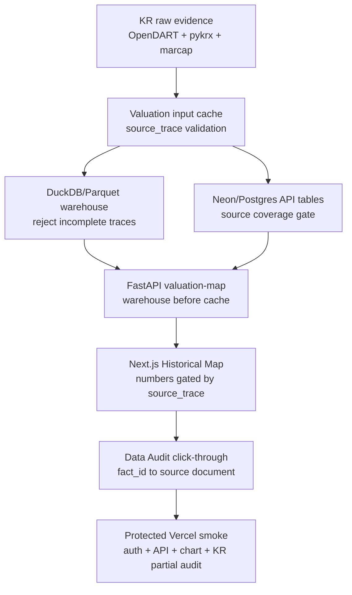

# KR Top10 Completion Plan

This document is the active completion plan for the first production-grade LUXON slice.
It keeps the scope focused: Korea first, source-backed numbers only, then UI and Vercel proof.

## Current Scope

- Market: KR first.
- Initial production universe:
  - `005930.KS`
  - `000660.KS`
  - `402340.KS`
  - `005380.KS`
  - `028260.KS`
  - `032830.KS`
  - `373220.KS`
  - `207940.KS`
  - `329180.KS`
  - `009155.KS`
- Data rule: no displayed financial number without `source_trace`.
- UI rule: FAST Graph-style valuation workflow, but LUXON-owned brand, layout details, code, assets, formulas, and audit UX.

## Latest Local Evidence

Verified on 2026-07-01:

- `pnpm e2e:source:kr:005930:local-dry-run`
  - Status: `local_raw_ready`
  - `005930.KS`: valuation-ready
- `pnpm build:valuation-inputs:kr:005930`
  - Status: `ok`
  - 66 normalized facts
  - 6 valuation points
  - coverage `complete`
- `pnpm load:valuation-warehouse:kr:005930`
  - Status: `ok`
  - 66 fact rows loaded
  - 6 valuation points loaded
  - 0 rejected rows
- `pnpm e2e:source:kr:top10:local-dry-run`
  - Status: `local_raw_ready`
  - 10/10 valuation-ready
  - 4 partial source-backed tickers
- `pnpm build:valuation-inputs:kr:top10`
  - Status: `ok`
  - 10/10 valuation-ready
  - 6 complete, 4 partial source-backed
- `pnpm load:valuation-warehouse:kr:top10`
  - Status: `ok`
  - 596 fact rows loaded
  - 51 valuation points loaded
  - 0 rejected rows
- `pnpm load:valuation-postgres:kr:top10:dry-run`
  - Status: `ok`
  - 596 metric rows planned
  - 54 adjusted earnings rows planned
  - 56 price rows planned
  - 0 rejected rows

Partial source-backed tickers are not broken. They are source-audited early-history gaps:

- `402340.KS`: missing 2020 market input and 2020-2022 OpenDART metric years.
- `032830.KS`: missing 2020-2022 OpenDART metric years.
- `373220.KS`: missing 2020-2021 market input before cached market history starts.
- `329180.KS`: missing 2020 market input before cached market history starts.

## Completion Gates



## Build Sequence

1. Keep `005930.KS` as the gold path.
   - It must remain complete through raw, cache, warehouse, API, web, Data Audit, and Vercel smoke.
2. Treat KR Top10 as production transition.
   - 10/10 must remain valuation-ready.
   - Partial rows must expose `gap_audit_refs` and resolvable Data Audit facts.
3. Promote local warehouse proof into deployed DB proof.
   - Run the same source-backed facts through Neon/Postgres.
   - Do not mark production complete while `source-coverage` is only local/cache-backed.
4. Lock the UI around four screens first.
   - Command Shell
   - Historical Valuation Map
   - Forecast Lab
   - Data Audit
5. Add broader screens after the KR proof is stable.
   - Financials
   - Performance
   - Screener
   - Portfolio

## Verification Commands

Local KR proof:

```powershell
pnpm e2e:source:kr:005930:local-dry-run
pnpm build:valuation-inputs:kr:005930
pnpm load:valuation-warehouse:kr:005930
python -m pytest tests/api/test_api.py::test_kr_priority_valuation_map_uses_warehouse_before_cache -q
```

Top10 transition proof:

```powershell
pnpm e2e:source:kr:top10:local-dry-run
pnpm build:valuation-inputs:kr:top10
pnpm load:valuation-warehouse:kr:top10
pnpm load:valuation-postgres:kr:top10:dry-run
pnpm readiness:kr:top10
python -m pytest tests/api/test_api.py::test_kr_valuation_cache_coverage_summarizes_complete_partial_and_missing -q
```

`pnpm readiness:kr:top10` is the operator checkpoint before deployment. It
summarizes local KR valuation-cache readiness, partial source-backed tickers,
Postgres source coverage, and the next commands without printing raw financial
payloads or secrets. The command list must include `load_kr_valuation_postgres`
before `source_coverage`. The expected transition status before Neon is
`ready_for_protected_smoke` or `local_warehouse_ready`. If the compact output
shows `source_coverage_status=ready` with `production_status=local_warehouse_only`,
the local DuckDB/Parquet proof is valid but Neon/Postgres promotion is still
missing. Final production requires `production_ready`.

Protected Vercel smoke:

```powershell
pnpm workflow:kr:smoke -- -BaseUrl https://your-private-preview.vercel.app -PartialAudit -PartialTickers 005930.KS -Watch
```

Full production gate after Neon/Postgres evidence is loaded:

```powershell
python -m services.ingestion_worker.cli load-kr-valuation-postgres --tickers 005930.KS,000660.KS,402340.KS,005380.KS,028260.KS,032830.KS,373220.KS,207940.KS,329180.KS,009155.KS --strict
python -m services.ingestion_worker.cli source-coverage --market KR --tickers 005930.KS,000660.KS,402340.KS,005380.KS,028260.KS,032830.KS,373220.KS,207940.KS,329180.KS,009155.KS --require-consensus-forecast --strict
pnpm smoke:api:kr -- --base-url https://your-private-preview.vercel.app
```

## Product Finish Definition

KR phase is complete when all of these are true:

- `005930.KS` is complete from raw evidence to web Data Audit.
- KR Top10 has 10/10 valuation-ready source-backed rows.
- Every partial ticker exposes explicit gap diagnostics, not silent missing values.
- Historical Valuation Map renders from warehouse/API data, not fixture data.
- Forecast Lab separates consensus, user assumptions, historical CAGR, and AI commentary.
- AI commentary does not generate financial values.
- Protected Vercel smoke passes with auth.
- Neon/Postgres source coverage passes the production gate.
- README, deployment docs, formula book, and data dictionary stay consistent with the implemented path.
