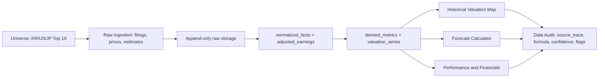
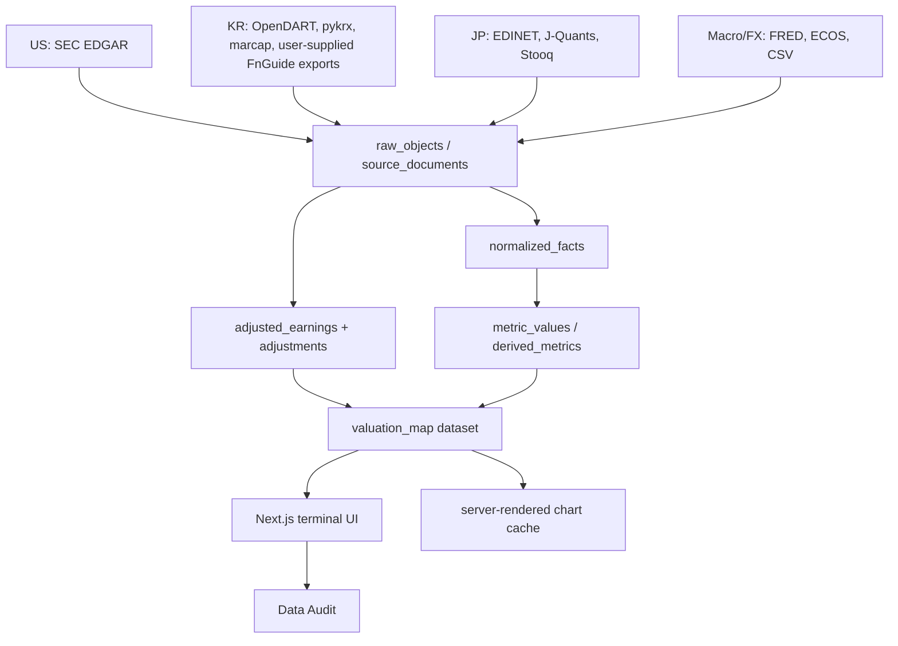

# LUXON Investment Terminal Product Strategy

## Purpose

LUXON Investment Terminal is a source-audited fundamental valuation product for
equity research. The product uses a FAST Graph-style analytical grammar:
price, earnings or selected fundamental metric, fair value line, normal
multiple line, dividend layer, forward estimate area, performance comparison,
and audit drill-down. The implementation remains LUXON-owned: own code, own
brand, own design system, own deterministic formulas, and no proprietary
assets.

The core product value is not only a chart. The core value is a repeatable
underwriting workflow:

1. Select a company universe.
2. Ingest source documents.
3. Normalize facts with source trace.
4. Compute valuation outputs with deterministic formulas.
5. Visualize history and 1Y-5Y forward scenarios.
6. Let the user inspect every number through Data Audit.

## Product Philosophy

- No invented financial numbers: LLMs may explain, route, and review, but they
  must not create EPS, price, dividend, estimate, or market-cap values.
- Source trace first: production numbers require `source_document_id`, source,
  filing or document id, period, unit, currency, method, formula, confidence,
  and quality flags.
- Raw append-only: source documents and raw API payloads are stored before
  normalization. Restatements are versioned, not overwritten.
- Forecasts are separated by evidence type:
  - source-backed consensus or company guidance,
  - deterministic historical CAGR projection,
  - explicit user assumptions,
  - AI commentary with no generated numbers.
- FAST Graph-style parity means workflow and analytical grammar parity. It does
  not mean copying protected code, private assets, brand identity, or vendor
  formulas.

## Rollout Order

### Phase 1: Top 10 E2E by Market

The first complete product slice covers 30 priority securities:

1. Korea Top 10
2. United States Top 10
3. Japan Top 10

The current priority lists are collection contracts, not live market-cap facts.
They are based on public market-cap ranking references observed on 2026-06-28.
Production ranking must be recomputed from source-backed market-cap, price, and
listed-share rows before the UI presents a live rank.

### Phase 2: Full Market Expansion

After the 30-stock E2E path is stable, expand in this order:

1. Korea full listed universe.
2. United States listed universe.
3. Japan listed universe.

This order matches the requested product priority and keeps the early UI close
to the target Korean use case while preserving the US adjusted-earnings engine.

## Data Architecture

## UX Scope

LUXON should feel like a professional finance terminal, not a marketing site.
The first screen is the working terminal.

Core screens:

- Company Terminal: snapshot, compact chart, key valuation and quality facts.
- Historical Valuation Map: price, fundamentals, normal multiple, fair value,
  dividend layer, forecast area, fiscal table, legend toggles.
- Forecast Calculator: consensus, historical CAGR, custom user assumptions, AI
  commentary, target price, CAGR, total return, margin of safety.
- Financials: statements, per-share metrics, margins, ROE, ROIC, debt, payout.
- Performance: price vs EPS comparison, valuation comparison, reinvest toggle,
  dividend cash flow table.
- Screener: metric-to-value, metric-to-metric, and company-relative filters.
- Portfolio: CSV transactions, XIRR, allocation, buy/sell valuation overlays.
- Data Audit: formula lineage, source documents, method, confidence, flags, and
  adjusted EPS waterfall.

## Deployment Model

- Web: Next.js on Vercel.
- API: FastAPI-compatible serverless read APIs where practical.
- Long-running ingestion: GitHub Actions or CLI worker, not Vercel request path.
- Database: Neon Postgres for production.
- Raw storage: Blob-compatible object storage with content-hash paths.
- Secrets: environment variables only; never committed.
- Access: private/protected preview first, then product-grade auth.

## Brand Direction

Product brand: LUXON Investment Terminal.

Design tokens:

- Brand: violet `#6D5EF6`.
- Price line: `#14161A`.
- Fundamental area: `#2E9E6B`.
- Forecast area: `#9BD8B8`.
- Normal multiple: `#2F6FED`.
- Fair value: `#F5912B`.
- Light background: `#FFFFFF`.
- Dark background: `#0E1116`.

Brand promise:

> Every valuation line must be explainable back to source evidence.

## Development Gates

A feature is production-ready only when:

1. It has source-backed or explicitly user-entered inputs.
2. It has source trace and formula lineage.
3. It has deterministic tests or golden files.
4. The UI exposes confidence and quality flags.
5. Fixture data is blocked in production mode.
6. The same input produces the same valuation output.

